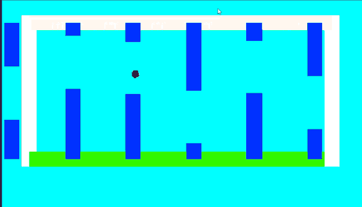

# FlappyBall — Reinforcement Learning with Unity ML-Agents

A Flappy Bird–style environment in which a ball-shaped agent learns to fly through gaps in procedurally generated pipes using **Unity ML-Agents** and **Proximal Policy Optimization (PPO)**. The agent perceives its surroundings through raycast "vision" and learns entirely from trial and error — no scripted behavior.



---

## Project Overview

The agent is a 2D ball affected by gravity. Its only control is a single **jump** action. Each episode, it must survive as long as possible by navigating through a stream of pipes with randomly positioned gaps, avoiding the ground, ceiling, walls, and the pipes themselves.

Learning is driven by a reward signal (survival, pipe passes, and a death penalty) and the agent is trained with PPO. Three separate training configurations were run to study how hyperparameters affect learning; their results are compared below.

---

## How It Works

### Observations (104 values total)

The agent receives two kinds of observations each step:

| Source | Count | Detail |
|---|---|---|
| Vector observations | 2 | Normalized vertical position and vertical velocity |
| Ray perception | 102 | Raycast "vision" of obstacles |

The ray count follows the ML-Agents formula `(2 × rays_per_direction + 1) × (detectable_tags + 2)`. With **8 rays per direction** and **4 detectable tags** (Ground, Ceiling, Wall, Pipe): `(2×8 + 1) × (4 + 2) = 17 × 6 = 102`. The rays fan out over a 90° spread on each side with a length of 10 units.

### Actions (1 discrete branch, 2 options)

| Value | Action |
|---|---|
| 0 | Do nothing (fall under gravity) |
| 1 | Jump (apply upward velocity) |

### Rewards

| Event | Reward |
|---|---|
| Each step survived | +0.001 |
| Passing through a pipe gap | +1.0 |
| Hitting a pipe, wall, ground, or ceiling | −1.0 (ends episode) |

Because passing a pipe is worth far more than surviving a single step, cumulative reward is dominated by how many pipes the agent clears — so higher reward corresponds directly to better pipe-navigation.

---

## Training Results

Three configurations were trained with PPO to ~300,000 steps each. All results below are **smoothed final values** read from TensorBoard; the raw curves are in [`docs/`](docs/).

| Config | Network | Buffer | Epochs | Learning Rate | Batch | Final Reward* |
|---|---|---|---|---|---|---|
| **v1 — Baseline** (`FlappyBall`) | 128 × 2 | 2048 | 3 | 3.0e-4 | 128 | ~51 |
| **v2 — Higher LR** (`FlappyBall2`) | 128 × 2 | 2048 | 3 | 5.0e-4 | 256 | ~45 |
| **v3 — Larger Network** (`FlappyBall3`) | 256 × 3 | 4096 | 5 | 3.0e-4 | 128 | ~50 (at ~230k steps) |

\* Smoothed cumulative reward near the end of training.

### What the experiments showed

- **v1 (baseline):** standard PPO settings with a small network. Learned the task reliably but was the slowest to climb and needed the most steps.
- **v2 (higher learning rate):** raising the learning rate (3e-4 → 5e-4) and batch size did **not** help — this run finished weakest of the three. A useful negative result: faster updates hurt stability here.
- **v3 (larger network):** keeping the conservative learning rate but adding network capacity (256×3), a larger buffer (4096), and more update epochs (5) was the most **efficient** learner — it matched the baseline's performance in roughly 50,000 fewer steps and was still improving when training stopped. **This is the featured model.**

**Takeaway:** the bottleneck was model capacity and update frequency, not learning speed. Raising the learning rate hurt; adding capacity helped.

### Honest limitations

- All three runs were **still improving** at their step limits — none had fully converged. Longer training would likely yield further gains. The numbers above are relative comparisons at a fixed step budget, not performance ceilings.
- The reward curves are **noisy** (large episode-to-episode variance), which is expected for a sparse-ish reward in a stochastic environment. The smoothed trends, not individual points, are the meaningful signal.
- In inference, the featured model (FlappyBall3) typically clears roughly 20–25 pipes per episode before failing (observed over several runs).

### Training curves


---

## Tech Stack

| Component | Version |
|---|---|
| Unity | 2021.3.45f2 (LTS) |
| Unity ML-Agents package | 2.0.2 |
| ML-Agents Python package | 0.30.0 |
| Python | 3.9 |
| Render pipeline | Universal RP (URP) 2D |
| Algorithm | PPO (Proximal Policy Optimization) |

---

## Getting Started

### Prerequisites

- Unity **2021.3 LTS** (or a compatible 2021.3.x version)
- Python **3.9**
- The ML-Agents Python package (`mlagents==0.30.0`)

### Watching a pre-trained agent (no training required)

1. Clone the repository:
   ```bash
   git clone https://github.com/Ghadiiz/FlappyBall-ML-Agents.git
   ```
2. Open the project in Unity Hub (it will resolve packages on first open).
3. Open the scene `Assets/Scenes/FlappyBallTraining.unity`.
4. Select the **Ball** agent in the Hierarchy. In **Behavior Parameters**, confirm the **Model** is set to `FlappyBall3` and **Behavior Type** is `Default`.
5. Press **Play** to watch the trained agent navigate the pipes.

### Training your own agent

1. Install the Python package:
   ```bash
   pip install mlagents==0.30.0
   ```
2. From the project root, start training with one of the configs:
   ```bash
   mlagents-learn Assets/Training/FlappyBall3.yaml --run-id=MyRun
   ```
3. Press **Play** in Unity when prompted to begin collecting experience.
4. Monitor progress with TensorBoard:
   ```bash
   tensorboard --logdir results
   ```
   Then open `http://localhost:6006`.

---

## Repository Structure

```
Assets/
  Scenes/          Training scene (FlappyBallTraining.unity)
  Scripts/         BallAgent.cs (agent logic), PipeSpawner.cs (obstacle generation)
  Prefabs/         TrainingEnvironment, PipePair
  TrainedModels/   FlappyBall, FlappyBall2, FlappyBall3 (.onnx)
  Training/        Per-run configs (FlappyBall*.yaml)
docs/              Training result graphs
```

---

## Author

**Ghadi Dababneh** — [github.com/Ghadiiz](https://github.com/Ghadiiz)

## Acknowledgments

- The Unity ML-Agents Toolkit team
- PPO — Schulman et al., 2017

## License

Released under the [MIT License](LICENSE).
